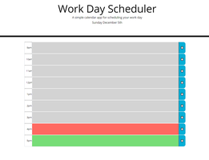
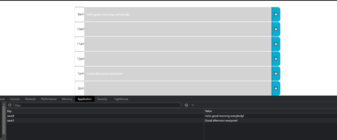

# Calendario-o-Luigi

## Description
This project assigment is a simple scheduling calendar for SMU Coding Bootcamp.

It comes with a built-in **saving** and **time dynamic** features! 

## Usage

1. Click on the large section on each row to input your desired text. 
   - The indicators are as follows: Present- **Red**, Future- **Green**, Past- **Grey**. 

2. After inputting your text, you will be able to save your inputs by clicking the blue save button by using local storage.
 

### Link
If you would like to try it using this [link, ](https://wingz003.github.io/Calendario-o-Luigi/) you will get your life back on track. 

Thank you very much!
